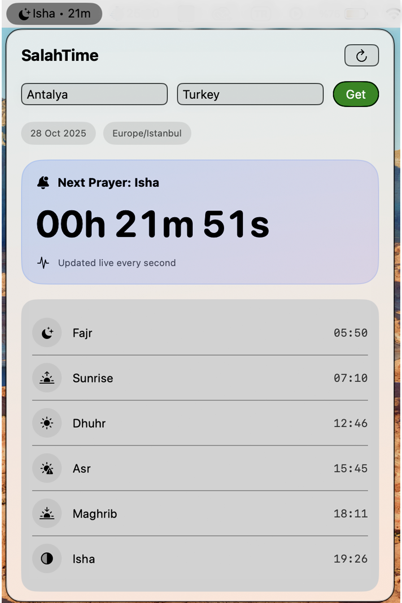

#SalahTime (macOS Application)

SalahTime is a simple and practical macOS menu bar application that shows the remaining time until the next prayer.
The app retrieves current prayer times based on the user’s city and country using the Aladhan API and displays them in a clear interface.

The menu bar icon continuously updates with the name of the next prayer and the remaining countdown time.
Users can open the popup window to change their city and country and refresh the prayer times manually.

#Features:

Displays the next prayer and countdown in the menu bar

City and country selection

Live countdown updated every second

Daily prayer time list

Clean and modern SwiftUI design

Integration with the Aladhan API

#Technical Information:

Language: Swift (SwiftUI)

Platform: macOS

API: Aladhan Prayer Times API

Version: v0.1.0

#Release Notes (v0.1.0):

Added menu bar integration

Fetching prayer times via API

Live countdown timer

Display of daily prayer times

## 🖼️ Screenshot

You can download the latest version of the SalahTime application from the Releases section on GitHub.
Go to: Releases

and download the .zip file of the version you want to use.

After downloading:

1) Unzip the file.

2) Move SalahTime.app to your Applications folder.

3) If macOS shows a security warning, click Open Anyway under System Settings → Privacy & Security.